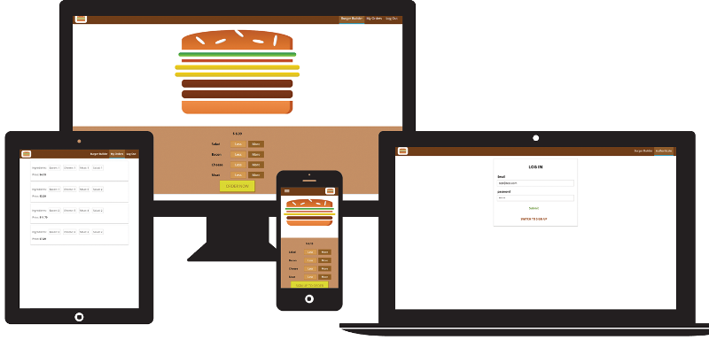

## [Burger Builder App (click to see DEMO)](https://react-burger-app-ff8c2.firebaseapp.com/)

[React - The Complete Guide (incl Hooks, React Router, Redux) | Udemy](https://www.udemy.com/course/react-the-complete-guide-incl-redux/)

## Tags

- v1.0 - Basic application
- v2.0 - Redux added to manage state
- v3.0 - Authentication and authorization implemented

## Clone

Clone this repo to your local machine using `https://github.com/KulovacNedim/burger-builder.git`
and run `npm init` to install all dependencies

## Available Scripts

In the project directory, you can run:

### `npm start`

Runs the app in the development mode.
Open [http://localhost:3000](http://localhost:3000) to view it in the browser.

### `npm run build`

Builds the app for production to the `build` folder. 

### `npm run eject`

**Note: this is a one-way operation. Once you `eject`, you can’t go back!**

If you aren’t satisfied with the build tool and configuration choices, you can `eject` at any time. This command will remove the single build dependency from your project.

Instead, it will copy all the configuration files and the transitive dependencies (Webpack, Babel, ESLint, etc) right into your project so you have full control over them. All of the commands except `eject` will still work, but they will point to the copied scripts so you can tweak them. At this point you’re on your own.

You don’t have to ever use `eject`. The curated feature set is suitable for small and middle deployments, and you shouldn’t feel obligated to use this feature. However we understand that this tool wouldn’t be useful if you couldn’t customize it when you are ready for it.
